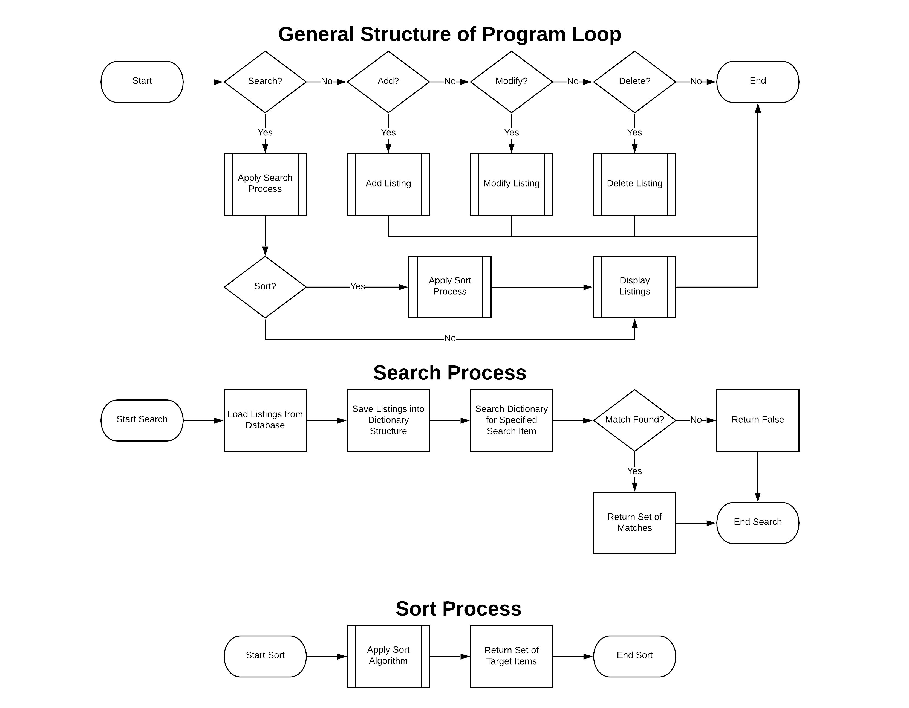

# Webay

Webay is an open-source webstore backend that implements efficient search algorithms to sort through thousands of mock listings. 

## Introduction

### Project description:

We will be creating a mock version of the [Ebay webstore](https://ebay.com)
that runs on the CLI. This mock store will have price sorting capabilities, a general search ability, and the ability to create/edit/delete listings. Our mock listings will be generated
using a list of preselected objects and associated adjectives.

### Objective/Purpose:

The purpose of creating this mock store is to learn how to implement search algorithms in an actual use-case situation. This is also a stepping stone towards our final project of creating a complete webstore application.
 
## Background/Related studies

Our backgrounds are in Python and Arduino. We will use previous knowledge and concepts to complete
most of our work.

### Background knowledge that led to inspiration:

We have wanted to create a website together since we began programming. 
We believe this to be an excellent opportunity to merge our course material 
with our personal goals. 

### Summaries and notes from your sources (e.g., research papers):

## Methods

### Your implementation plan (e.g., using open-source libraries or algorithms that you've found from research articles):

We plan on using the Python standard library with no external libraries to create our program.
We will also implement a search algorithm after researching various options. 

### What other sources would be available (e.g., Github, StackOverflow, etc):

Official Python Docs, Github, StackOverflow, Learn Python the Hard Way (3rd, Zed Shaw)

## Discussion

### Potential Challenges that you expect to see:

We expect to face challenges in implementing a search algorithm as neither
of us have done so before. We also expect to face challenges with maintaining
our data integrity since a listing may contain very much information. 

### What you expect to learn from this project

We expect to learn how to implement a search algorithm to sort through listing data.
We also expect to learn how to create and manage a custom webstore backend. 

## Reference

### Your resources, at least two academic articles (e.g., book or research paper)

[Python Documentation: JSON](https://docs.python.org/3.7/tutorial/inputoutput.html#reading-and-writing-files)

[Python Documentation: Argparse](https://docs.python.org/3/library/argparse.html)

# Documentation

## To Do

- [x] Add *Add Listing* option.
- [x] Add *Edit Listing* option.
- [x] Add *Delete Listing* option.
- [x] Add *Search Titles* option.
- [ ] Add *Price Sorting* option.
- [ ] Combine price sorting and title sorting for smarter search.
- [x] Add *Print Listings* option.
- [ ] Finish project proposal.
